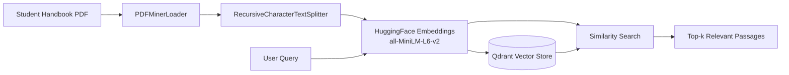

# Student Handbook Semantic Search

> A retrieval pipeline that turns a Student Handbook PDF into a searchable knowledge base, so students and staff can find policies, procedures, and official messages by meaning rather than by exact keywords.


---

## Table of Contents

1. [Overview](#overview)
2. [Key Features](#key-features)
3. [Architecture](#architecture)
4. [Technology Stack](#technology-stack)
5. [Getting Started](#getting-started)
6. [Usage](#usage)
7. [Configuration](#configuration)
8. [Project Structure](#project-structure)
9. [Troubleshooting](#troubleshooting)
10. [Roadmap](#roadmap)
11. [Contributing](#contributing)
12. [License](#license)

---

## Overview

University handbooks are long, dense, and difficult to navigate. Finding an answer such as *"What is the message from the founder?"* or *"What is the attendance policy?"* usually means scrolling through hundreds of pages.

This project ingests a Student Handbook PDF, splits it into semantically meaningful chunks, converts each chunk into a vector embedding, and stores them in a Qdrant vector database. Natural-language queries are then matched against the stored vectors to return the most relevant passages.

The pipeline is also the retrieval foundation for a full Retrieval-Augmented Generation (RAG) chatbot, where an LLM answers questions grounded in the retrieved handbook text.

## Key Features

- **Semantic search**: finds relevant passages by meaning, not exact keyword match.
- **End-to-end ingestion**: PDF loading, text splitting, embedding, and indexing in a single script.
- **Local-first**: runs fully offline after the model download, with no API keys or external services.
- **Persistent storage**: the index is saved on disk and can be reloaded without re-embedding.
- **Configurable**: chunk size, overlap, model, and storage location are plain constants.
- **Notebook friendly**: designed to run in Google Colab or Jupyter.

## Architecture



**Pipeline stages**

| Stage | Component | Purpose |
|-------|-----------|---------|
| 1. Load | `PDFMinerLoader` | Extracts raw text from the PDF |
| 2. Split | `RecursiveCharacterTextSplitter` | Breaks text into overlapping chunks |
| 3. Embed | `all-MiniLM-L6-v2` | Converts each chunk into a 384-dimensional vector |
| 4. Index | `QdrantVectorStore` | Stores vectors and metadata for fast retrieval |
| 5. Retrieve | `similarity_search` | Returns the top-k closest chunks to a query |

## Technology Stack

| Layer | Technology |
|-------|------------|
| Language | Python 3.10+ |
| Orchestration | LangChain (`langchain-community`, `langchain-text-splitters`) |
| Embeddings | `sentence-transformers/all-MiniLM-L6-v2` via `langchain-huggingface` |
| Vector database | Qdrant (local mode) via `qdrant-client` and `langchain-qdrant` |
| PDF parsing | PDFMiner (`pdfminer.six`) |

## Getting Started

### Prerequisites

- Python 3.10 or higher
- A Student Handbook PDF
- Around 500 MB of free disk space for the embedding model and dependencies

### Installation

```bash
# 1. Clone the repository
git clone https://github.com/<your-username>/<your-repo>.git
cd <your-repo>

# 2. (Recommended) Create a virtual environment
python -m venv .venv
source .venv/bin/activate        # Windows: .venv\Scripts\activate

# 3. Install dependencies
pip install langchain-community langchain-text-splitters langchain-huggingface \
            langchain-qdrant qdrant-client sentence-transformers pdfminer.six
```

### Google Colab

Upload the PDF to `/content/` and run the install command in a cell prefixed with `!pip install ...`.

## Usage

```python
from langchain_community.document_loaders import PDFMinerLoader
from langchain_text_splitters import RecursiveCharacterTextSplitter
from langchain_huggingface import HuggingFaceEmbeddings
from langchain_qdrant import QdrantVectorStore

PDF_PATH = "/content/Student_HandBook.pdf"
CHUNK_SIZE = 1000
CHUNK_OVERLAP = 100

# Load and split
pdf_content = PDFMinerLoader(PDF_PATH).load()
splitter = RecursiveCharacterTextSplitter(
    chunk_size=CHUNK_SIZE, chunk_overlap=CHUNK_OVERLAP
)
documents = splitter.split_documents(pdf_content)

# Embed and index
embeddings = HuggingFaceEmbeddings(
    model_name="sentence-transformers/all-MiniLM-L6-v2"
)
qdrant = QdrantVectorStore.from_documents(
    documents,
    embeddings,
    path="/tmp/local_qdrant",
    collection_name="my_documents",
)

# Query
results = qdrant.similarity_search("What is the message from founder", k=3)
for i, doc in enumerate(results, 1):
    print(f"--- Result {i} ---")
    print(doc.page_content)
```

### Reloading an Existing Index

To query a previously built index without re-embedding the PDF:

```python
from qdrant_client import QdrantClient

client = QdrantClient(path="/tmp/local_qdrant")
qdrant = QdrantVectorStore(
    client=client,
    collection_name="my_documents",
    embedding=embeddings,
)
```

## Configuration

| Parameter | Default | Description |
|-----------|---------|-------------|
| `PDF_PATH` | `/content/Student_HandBook.pdf` | Location of the source document |
| `CHUNK_SIZE` | `1000` | Maximum characters per chunk |
| `CHUNK_OVERLAP` | `100` | Characters shared between adjacent chunks to preserve context |
| `model_name` | `sentence-transformers/all-MiniLM-L6-v2` | Embedding model |
| `path` | `/tmp/local_qdrant` | On-disk location of the Qdrant index |
| `collection_name` | `my_documents` | Name of the Qdrant collection |
| `k` | `3` | Number of passages returned per query |

> **Tip:** `/tmp` is cleared when a Colab runtime ends. Point `path` at a mounted Google Drive folder if you want the index to persist between sessions.

## Project Structure

```
.
├── README.md
├── requirements.txt
├── data/
│   └── Student_HandBook.pdf
├── notebooks/
│   └── handbook_search.ipynb
└── src/
    └── ingest.py
```

Adjust this layout to match your repository.

## Troubleshooting

| Issue | Cause | Resolution |
|-------|-------|------------|
| `RuntimeError: Storage folder ... is already accessed by another instance of Qdrant client` | Local Qdrant locks its folder, and a previous client is still open in the kernel | Restart the runtime, call `client.close()`, or use `location=":memory:"` during development |
| `TypeError: ... unexpected keyword argument 'client'` | `from_documents()` does not accept a `client` argument | Pass `path=...` instead, or build the store with `QdrantVectorStore(client=..., ...)` |
| Irrelevant or fragmented results | PDF text extraction produced broken lines or headings | Inspect `pdf_content[0].page_content[:2000]`, or try `PyPDFLoader` |
| Slow first run | The embedding model is being downloaded | Subsequent runs use the cached model |

## Roadmap

- [ ] Add an LLM answer-generation step to complete the RAG workflow
- [ ] Preserve page numbers in metadata for source citations
- [ ] Build a web interface (Streamlit or Gradio)
- [ ] Support multiple documents and collections
- [ ] Add retrieval quality evaluation with a labeled question set

## Contributing

Contributions are welcome.

1. Fork the repository
2. Create a feature branch: `git checkout -b feature/your-feature`
3. Commit your changes: `git commit -m "Add your feature"`
4. Push to the branch: `git push origin feature/your-feature`
5. Open a Pull Request

## License

This project is distributed under the MIT License. See [`LICENSE`](LICENSE) for details.

## Author

**Your Name**
[GitHub](https://github.com/<your-username>) · [LinkedIn](https://linkedin.com/in/<your-profile>) · your.email@example.com
